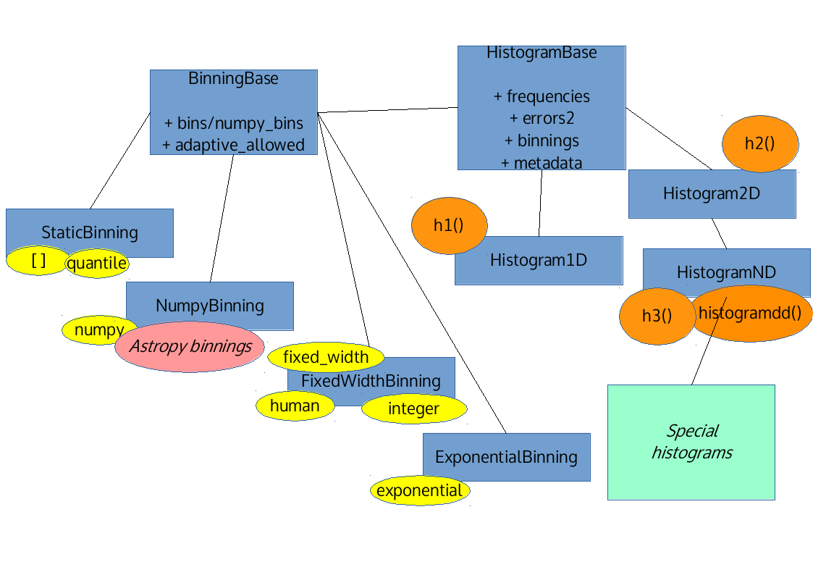

<!-- for https://indico.cern.ch/event/759556/ -->

<link rel="stylesheet" href="https://use.fontawesome.com/releases/v5.1.0/css/all.css" integrity="sha384-lKuwvrZot6UHsBSfcMvOkWwlCMgc0TaWr+30HWe3a4ltaBwTZhyTEggF5tJv8tbt" crossorigin="anonymous"/>
<link href="https://fonts.googleapis.com/css?family=Ubuntu" rel="stylesheet"/>
<link href="https://fonts.googleapis.com/css?family=Palanquin" rel="stylesheet">
<link href="https://fonts.googleapis.com/css?family=Montserrat" rel="stylesheet">
<link href="https://fonts.googleapis.com/css?family=Quicksand" rel="stylesheet"> 

<!-- .slide: data-background="background.png" -->

# physt 

<div style="height: 1em"></div>

### DIANA meeting, <span style="font-size: 80%; opacity:0.5">1<sup style="font-size: 60%">st</sup> October 2018</span>

##### Jan Pipek, <span style="font-size: 80%; text-transform: none; opacity:0.5">Showmax</span>

<div style="height: .5em"></div>

<div><i class="fab fa-github"></i> [janpipek/physt](https://github.com/janpipek/physt)</div>
---

## Background

<div style="height: 1em"></div>

<b style="opacity:0.8; margin: .5em;">2001-2007</b> masters in physics (HEP)

<b style="opacity:0.8; margin: .5em;">2007-2015</b> Ph.D. in medical physics (Geant4)

<b style="opacity:0.8; margin: .5em;">2015-2017</b> post-doc in mdical physics (Geant4)

<b style="opacity:0.8; margin: .5em;">2017-</b> data scientist @ Showmax, Prague

---

## Motivation

<div style="height: .5em"></div>

```python
import numpy as np
histogram = np.histogram(heights)
```

<div class="fragment output">

<div style="height: .5em"></div>

```python
(array([  4,  22,  96, 228, 272,          # Frequencies
        226, 104,  38,   9,   1]),


 array([132.1841, 141.0516, 149.9191,     # Edges
        158.7866, 167.6541, 176.5216,
        185.3891, 194.2566, 203.1241,
        211.9916, 220.8591])
```
</div>

<div style="height: .5em"></div>

<p class="fragment"><i class="fas fa-frown"></i> Tuple of arrays?</p>

---

## Motivation (cont'd)

* In 2016, no adequate histogramming in Python (?)

* Lots of particle/dose distributions (2D, 3D) to visualize

* Will to create a useful open source library on my own

<p class="fragment" style="font-size: 150%">=> Physt</p>

---

## Target use cases

* Data exploration

* Compact representation of distributions

* Visualization / presentation

<div style="height: .5em"></div>

*General, non-field-specific audience.*

---

## Design goals

* simple & familiar API (~numpy, ~pandas)

* histogram as first-class object (ROOT-inspired)

* no complex dependencies
  
  * **numpy** necessary

  * **matplotlib** recommended 

* extensibility (visualization, computing engines, IO)

---

## Status

https://github.com/janpipek/physt

528 commits, 

2 main branches

- version 0.3.43 (rich features)

- re-design 0.4 (goal: cleaner API)

---

## Example 1

```python
import pandas as pd
from physt import h1

particles = pd.read_csv("protons.csv")
h = h1(particles["energy"], title="Energy distribution of protons")
```

<div class="fragment output">

<div style="height: .5em"></div>

```python
Histogram1D(bins=(10,), total=100000, dtype=int64)
```

</div>

---

```python
h.plot()
```

<div style="height: .5em"></div>


---

```python
h.frequencies
```

<div class="output">

<div style="height: .2em"></div>

```python
array([   18,   346,  3383, 14978, 31434, 31348, 14827,  3318,   330,  18])
```

</div>

<div style="height: 1.2em"></div>

```python
h.bins
```

<div class="output">

<div style="height: .2em"></div>

```python
array([[ 38.83518235,  ...,  81.791677  ]])
```

</div>

<div style="height: 1.2em"></div>

```python
h.binning
```

<div class="output">

<div style="height: .2em"></div>

```python
NumpyBinning(array([ 38.83518235, ...,  81.791677  ]))
```

</div>

---



---

## Binning schemas

* numpy (+ optimized bin counts)
* fixed-width (adaptive)
    * human (special case)
    * integer (special case)
* exponential
* quantile

---

## Adaptive binning

```
hx = h2(particles["x"], particles["y"], "fixed_width", 5, adaptive=True)

hx.plot(figsize=(5, 5), show_zero=False, show_colorbar=False, cmap="rainbow")

hx << (43.4, -27.5)
hx.plot(figsize=(5, 5), show_zero=False, show_colorbar=False, cmap="rainbow")
```

<div></div>

---

## Computation engines

* Currently, **numpy** is doing most of the work.

* Experimental usage of **dask** for "big" data.

* **tensorflow**?

---

## Plotting backends

* **matplotlib** (standard)

* **vega** (for notebooks)

* **plotly** (way to go?)

* **ascii** (wish I had it)

---

```
hx = h2(particles["x"], particles["y"], "fixed_width", 5)

# Matplotlib
hx.plot(show_zero=False, cmap="plasma", title="matplotlib (default)")

# Vega
hx.plot(backend="vega", show_zero=False, cmap="plasma", title="vega (explicit)")
```

<div>
    
    
</div>

---

<!-- .slide: data-background="background.png" -->

<div>
    <div><i class="fab fa-github"></i> [janpipek/physt](https://github.com/janpipek/physt)</div>
    <div style="height:0.5em;"></div>
    <div><i class="fas fa-envelope"></i> jan.pipek@gmail.com</div>
<div>